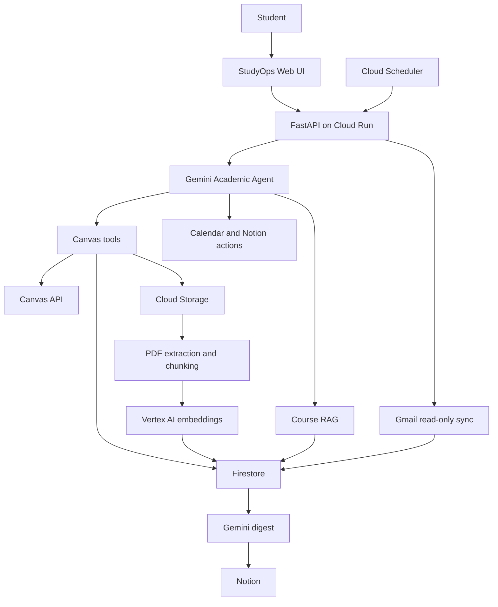

# StudyOps

StudyOps is a persistent academic agent that combines Canvas course
content, retrieve Canvas material, Gmail notifications, Google Calendar
and Notion into one student workspace.

It was created for the Taskmaster track for the **All Things Agentic Hackathon 2026**

## Problem Statement

Students nowadays keep switching between Canvas, download lecture PDFs, updating Gmail everyday, checking Calendar for deadlines and Notion to answer a few recurring questions:

- What tutotial or assignment is due next?
- What does this assignment require?
- What do my lecture materials say about this topic?
- How can I swiftly summarise my lecture materials?
- Can I turn this deadline into a Calendar event?
- Did a lecturer send an important update?
- Can I save a personalized course summary to Notion?

StudyOps then coordinates these systems while keeping external writes behind
explicit confirmation.

## Main features

- Retrieves Canvas courses, modules, pages, assignments, quizzes and files.
- Extracts and chunks PDF course materials.
- Generates Vertex AI embeddings for semantic retrieval.
- Answers course questions with grounded source citations.
- Lists upcoming Canvas deadlines.
- Retrieves structured assignment and quiz information.
- Prepares Google Calendar proposals from Canvas deadlines.
- Requires explicit confirmation before creating Calendar events.
- Persists multi-turn conversation history in Firestore.
- Stores episodic events and confirmed summary preferences.
- Generates personalized course summaries.
- Prepares confirmation-protected Notion publishing actions.
- Reads Gmail with the read-only OAuth scope.
- Filters relevant Canvas, lecturer and campus messages.
- Generates a daily Gmail digest with Gemini.
- Publishes the digest to Notion through Cloud Scheduler.
- Uses Firestore checkpoints and message IDs for idempotent Gmail sync.

## Safety model

StudyOps treats all Canvas documents, Gmail messages and external tool
results as untrusted data.

Important protections include:

- Canvas integration is strictly read-only.
- Gmail uses `gmail.readonly`.
- Calendar events are proposals until the user explicitly confirms them.
- Manual Notion summary publication also requires confirmation.
- Pending actions expire and have explicit lifecycle states.
- Completed actions are idempotent to prevent duplicate writes.
- Gmail history checkpoints advance only after message processing succeeds.
- Scheduler routes require Cloud Run IAM and a shared scheduler secret.
- Secrets are loaded from Secret Manager in production.
- The production Cloud Run service remains private.

## Architecture



## Important workflows

### Course ingestion and RAG

1. A scheduled or manual Canvas sync reads Canvas data.
2. Normalized source records are deduplicated.
3. PDFs are stored in Cloud Storage.
4. Text is extracted and split into stable chunks.
5. Vertex AI creates embeddings.
6. Chunks and embedding metadata are persisted in Firestore.
7. User questions retrieve relevant chunks.
8. Gemini generates a grounded answer with citations.

### Calendar action

1. The student asks StudyOps to schedule an assignment.
2. The agent retrieves the Canvas assignment and selected date.
3. StudyOps creates a pending Calendar proposal.
4. The UI displays the proposed event.
5. Only explicit confirmation creates the Google Calendar event.
6. Cancellation and repeated confirmation are handled safely.

### Daily Gmail-to-Notion digest

1. Cloud Scheduler calls the private Gmail scheduler endpoint.
2. Gmail incremental history retrieves newly added messages.
3. Relevant academic messages are classified and persisted.
4. Gemini summarizes unpublished relevant messages.
5. A daily digest page is created in Notion.
6. Published messages are marked to prevent duplicate digests.
7. The Firestore Gmail history checkpoint advances after success.

## Technology

### Agent and AI

- Gemini 3.7 Flash
- Google GenAI SDK
- Vertex AI
- `gemini-embedding-001`
- Retrieval-augmented generation
- Gemini function calling

### Backend

- Python 3.12
- FastAPI
- Pydantic
- HTTPX
- Pytest

### Google Cloud

- Cloud Run
- Firestore
- Cloud Storage
- Vertex AI
- Secret Manager
- Cloud Scheduler
- Cloud Tasks
- Cloud Build

### Integrations

- Canvas LMS API
- Gmail API with read-only OAuth
- Google Calendar API
- Notion API

## Repository structure

```text
app/
├── connectors/       # Canvas, Gmail, Calendar and Notion clients
├── core/             # Application settings
├── jobs/             # Gmail and scheduled jobs
├── models/           # Request and response models
├── repositories/     # Firestore, Storage, actions and memory
├── routes/           # FastAPI routes
├── services/         # Agent, RAG, ingestion and action services
├── static/           # StudyOps web interface
├── workers/          # Email and ingestion processors
└── main.py           # FastAPI application

scripts/               # Integration and repository verification scripts
tests/                 # Automated tests
requirements.txt
README.md              # Development and Workflow Instructions
```

## Prerequisites

Install:

- Python 3.12
- Git
- Google Cloud CLI
- A Google Cloud project with billing enabled
- A Canvas API access token
- A Google OAuth Web application
- A Notion integration and accessible parent page

The Gmail and Calendar OAuth client must request:

```text
https://www.googleapis.com/auth/gmail.readonly
https://www.googleapis.com/auth/calendar.events
```

## Local installation

### 1. Clone the repository

```bash
git clone <REPOSITORY_URL>
cd <REPOSITORY_DIRECTORY>
```

### 2. Create the Python environment

```bash
python3.12 -m venv .venv
source .venv/bin/activate

python -m pip install --upgrade pip
python -m pip install -r requirements.txt
```

### 3. Authenticate Google Cloud locally

```bash
gcloud auth login
gcloud auth application-default login
gcloud config set project <GOOGLE_CLOUD_PROJECT>
```

### 4. Enable the required APIs

```bash
gcloud services enable \
  aiplatform.googleapis.com \
  artifactregistry.googleapis.com \
  calendar-json.googleapis.com \
  cloudbuild.googleapis.com \
  cloudscheduler.googleapis.com \
  cloudtasks.googleapis.com \
  firestore.googleapis.com \
  gmail.googleapis.com \
  run.googleapis.com \
  secretmanager.googleapis.com \
  storage.googleapis.com \
  --project="<GOOGLE_CLOUD_PROJECT>"
```

### 5. Create Firestore

Create a Firestore Native database named `(default)` in the Google
Cloud console, or run:

```bash
gcloud firestore databases create \
  --database="(default)" \
  --location="asia-southeast1" \
  --type="firestore-native" \
  --project="<GOOGLE_CLOUD_PROJECT>"
```

Skip this command if the database already exists.

### 6. Configure Canvas

Generate an access token from your Canvas account settings. The token is
used only by the server and must never be committed.

### 7. Configure Google OAuth

In Google Cloud Console:

1. Open **Google Auth Platform**.
2. Configure the application branding and audience.
3. Add your Google account under **Audience → Test users**.
4. Create an OAuth client with application type **Web application**.
5. Add this local authorized redirect URI:

```text
http://localhost:8000/gmail/oauth/callback
```

6. Enable the Gmail and Google Calendar APIs.

### 8. Configure Notion

1. Create a Notion internal integration.
2. Copy the integration token.
3. Create or select the parent Notion page.
4. Open the page menu and connect the integration.
5. Copy the page ID from its URL.

### 9. Create `.env`

Create a `.env` file in the repository root:

```dotenv
APP_NAME=StudyOps
APP_ENV=local

GOOGLE_CLOUD_PROJECT=<GOOGLE_CLOUD_PROJECT>
GOOGLE_CLOUD_LOCATION=global
FIRESTORE_DATABASE=(default)

EMBEDDING_MODEL=gemini-embedding-001
EMBEDDING_DIMENSION=768
GENERATION_MODEL=gemini-3.7-flash
RAG_DEFAULT_SOURCE_LIMIT=8
RAG_MIN_SIMILARITY=0.60

CANVAS_BASE_URL=https://canvas.nus.edu.sg
CANVAS_ACCESS_TOKEN=<CANVAS_ACCESS_TOKEN>
CANVAS_REQUEST_TIMEOUT_SECONDS=30

NOTION_BASE_URL=https://api.notion.com/v1
NOTION_API_KEY=<NOTION_API_KEY>
NOTION_PARENT_PAGE_ID=<NOTION_PARENT_PAGE_ID>
NOTION_API_VERSION=2026-03-11
NOTION_REQUEST_TIMEOUT_SECONDS=30

GMAIL_CLIENT_ID=<GOOGLE_OAUTH_CLIENT_ID>
GMAIL_CLIENT_SECRET=<GOOGLE_OAUTH_CLIENT_SECRET>
GMAIL_REDIRECT_URI=http://localhost:8000/gmail/oauth/callback
GMAIL_OAUTH_STATE_SECRET=<LONG_RANDOM_VALUE>
GMAIL_TOKEN_PATH=data/gmail_credentials.json
GMAIL_SYNC_STATE_PATH=data/gmail_sync_state.json
GMAIL_SYNC_QUERY=in:inbox newer_than:30d
GMAIL_MAX_MESSAGES_PER_SYNC=50
GMAIL_SYNC_USER_ID=<STUDYOPS_USER_ID>

GMAIL_NOTION_DIGEST_ENABLED=true
GMAIL_DIGEST_COURSE_ID=<CANVAS_COURSE_ID>
GMAIL_DIGEST_MAX_MESSAGES=50
GMAIL_DIGEST_TIMEZONE=Asia/Singapore

CLOUD_TASKS_LOCATION=asia-southeast1
CLOUD_TASKS_QUEUE=canvas-sync
CLOUD_TASKS_WORKER_BASE_URL=
CLOUD_TASKS_SERVICE_ACCOUNT_EMAIL=
CLOUD_TASKS_DISPATCH_DEADLINE_SECONDS=1800

SCHEDULER_SHARED_SECRET=<LONG_RANDOM_VALUE>
```

Generate random values with:

```bash
openssl rand -hex 32
```

The `.env` file and `data/gmail_credentials.json` must remain ignored by
Git.

### 10. Start StudyOps

```bash
uvicorn app.main:app \
  --host="127.0.0.1" \
  --port=8000 \
  --reload
```

Open:

```text
http://127.0.0.1:8000
```

### 11. Connect Gmail and Calendar

Open:

```text
http://127.0.0.1:8000/gmail/oauth/authorize
```

Sign in with a Google account registered as an OAuth test user and grant
the requested Gmail read-only and Calendar event permissions.

Successful authorization returns:

```json
{
  "status": "connected",
  "refresh_token_saved": true
}
```

Verify the connection:

```bash
curl -s \
  "http://127.0.0.1:8000/gmail/status" \
  | python -m json.tool
```

## Local verification

### Health check

```bash
curl -s \
  "http://127.0.0.1:8000/health" \
  | python -m json.tool
```

### Canvas status

```bash
curl -s \
  "http://127.0.0.1:8000/canvas/status" \
  | python -m json.tool
```

### Run Canvas ingestion

```bash
curl -s -X POST \
  -H "X-Scheduler-Secret: ${SCHEDULER_SHARED_SECRET}" \
  -H "Content-Type: application/json" \
  -d '{
    "canvas_user_id": "<CANVAS_USER_ID>",
    "course_id": "<CANVAS_COURSE_ID>"
  }' \
  "http://127.0.0.1:8000/internal/canvas/sync" \
  | python -m json.tool
```

### Ask the academic agent

```bash
curl -s -X POST \
  -H "Content-Type: application/json" \
  -d '{
    "user_id": "<CANVAS_USER_ID>",
    "course_id": "<CANVAS_COURSE_ID>",
    "session_id": "readme-test",
    "message": "What types of storage are described in the course materials?",
    "source_limit": 8
  }' \
  "http://127.0.0.1:8000/api/v1/agent/chat" \
  | python -m json.tool
```

### Run Gmail-to-Notion manually

```bash
curl -s -X POST \
  -H "X-Scheduler-Secret: ${SCHEDULER_SHARED_SECRET}" \
  "http://127.0.0.1:8000/internal/scheduler/gmail" \
  | python -m json.tool
```

A successful result contains separate `sync` and `digest` sections.

### Run automated tests

```bash
python -m compileall app scripts tests
python -m pytest -q
git diff --check
```

Expected result at submission:

```text
31 passed
```

## Production deployment

The production service is intentionally private.

### 1. Set deployment variables

```bash
export STUDYOPS_PROJECT_ID="<GOOGLE_CLOUD_PROJECT>"
export STUDYOPS_REGION="asia-southeast1"
export STUDYOPS_SERVICE_NAME="studyops-api"
export STUDYOPS_RUNTIME_SA="studyops-api@${STUDYOPS_PROJECT_ID}.iam.gserviceaccount.com"
export STUDYOPS_SCHEDULER_SA="studyops-scheduler@${STUDYOPS_PROJECT_ID}.iam.gserviceaccount.com"

gcloud config set project \
  "${STUDYOPS_PROJECT_ID}"
```

### 2. Create runtime identities

```bash
gcloud iam service-accounts create \
  studyops-api \
  --display-name="StudyOps Cloud Run runtime" \
  --project="${STUDYOPS_PROJECT_ID}"

gcloud iam service-accounts create \
  studyops-scheduler \
  --display-name="StudyOps Cloud Scheduler" \
  --project="${STUDYOPS_PROJECT_ID}"
```

Skip an account if it already exists.

Grant the Cloud Run runtime the required roles:

```bash
for STUDYOPS_ROLE in \
  roles/aiplatform.user \
  roles/datastore.user \
  roles/storage.objectAdmin \
  roles/cloudtasks.enqueuer \
  roles/secretmanager.secretAccessor
do
  gcloud projects add-iam-policy-binding \
    "${STUDYOPS_PROJECT_ID}" \
    --member="serviceAccount:${STUDYOPS_RUNTIME_SA}" \
    --role="${STUDYOPS_ROLE}"
done
```

For a production system, storage access should preferably be restricted
to the specific StudyOps bucket.

### 3. Create production secrets

Create these Secret Manager secrets:

```text
studyops-canvas-access-token
studyops-notion-api-key
studyops-gmail-client-id
studyops-gmail-client-secret
studyops-gmail-refresh-token
studyops-gmail-oauth-state-secret
studyops-scheduler-shared-secret
```

Example:

```bash
gcloud secrets create \
  studyops-canvas-access-token \
  --replication-policy="automatic" \
  --project="${STUDYOPS_PROJECT_ID}"

printf '%s' '<CANVAS_ACCESS_TOKEN>' \
| gcloud secrets versions add \
    studyops-canvas-access-token \
    --data-file=- \
    --project="${STUDYOPS_PROJECT_ID}"
```

Repeat for the remaining secrets. Prefer adding secret values through
the Secret Manager console so they do not enter terminal history.

Never place secrets directly in the repository or deployment command.

### 4. Deploy the private Cloud Run service

```bash
gcloud run deploy \
  "${STUDYOPS_SERVICE_NAME}" \
  --source="." \
  --region="${STUDYOPS_REGION}" \
  --project="${STUDYOPS_PROJECT_ID}" \
  --service-account="${STUDYOPS_RUNTIME_SA}" \
  --no-allow-unauthenticated \
  --set-secrets="CANVAS_ACCESS_TOKEN=studyops-canvas-access-token:latest,NOTION_API_KEY=studyops-notion-api-key:latest,GMAIL_CLIENT_ID=studyops-gmail-client-id:latest,GMAIL_CLIENT_SECRET=studyops-gmail-client-secret:latest,GMAIL_REFRESH_TOKEN=studyops-gmail-refresh-token:latest,GMAIL_OAUTH_STATE_SECRET=studyops-gmail-oauth-state-secret:latest,SCHEDULER_SHARED_SECRET=studyops-scheduler-shared-secret:latest" \
  --set-env-vars="APP_ENV=production,GOOGLE_CLOUD_PROJECT=${STUDYOPS_PROJECT_ID},GOOGLE_CLOUD_LOCATION=global,FIRESTORE_DATABASE=(default),GENERATION_MODEL=gemini-3.7-flash,EMBEDDING_MODEL=gemini-embedding-001,NOTION_API_VERSION=2026-03-11,GMAIL_SYNC_USER_ID=<CANVAS_USER_ID>,GMAIL_DIGEST_COURSE_ID=<CANVAS_COURSE_ID>,GMAIL_DIGEST_TIMEZONE=Asia/Singapore,GMAIL_NOTION_DIGEST_ENABLED=true,CLOUD_TASKS_LOCATION=${STUDYOPS_REGION},CLOUD_TASKS_QUEUE=canvas-sync"
```

Retrieve the URL:

```bash
export STUDYOPS_SERVICE_URL="$(
  gcloud run services describe \
    "${STUDYOPS_SERVICE_NAME}" \
    --region="${STUDYOPS_REGION}" \
    --project="${STUDYOPS_PROJECT_ID}" \
    --format="value(status.url)"
)"

echo "${STUDYOPS_SERVICE_URL}"
```

### 5. Configure the production OAuth redirect

Add the following URI to the Google OAuth Web client:

```text
<STUDYOPS_SERVICE_URL>/gmail/oauth/callback
```

Update Cloud Run:

```bash
gcloud run services update \
  "${STUDYOPS_SERVICE_NAME}" \
  --region="${STUDYOPS_REGION}" \
  --project="${STUDYOPS_PROJECT_ID}" \
  --update-env-vars="GMAIL_REDIRECT_URI=${STUDYOPS_SERVICE_URL}/gmail/oauth/callback,CLOUD_TASKS_WORKER_BASE_URL=${STUDYOPS_SERVICE_URL}"
```

### 6. Configure the scheduler identity

Allow only the scheduler service account to invoke Cloud Run:

```bash
gcloud run services add-iam-policy-binding \
  "${STUDYOPS_SERVICE_NAME}" \
  --region="${STUDYOPS_REGION}" \
  --project="${STUDYOPS_PROJECT_ID}" \
  --member="serviceAccount:${STUDYOPS_SCHEDULER_SA}" \
  --role="roles/run.invoker"
```

### 7. Create the midnight Gmail digest schedule

Retrieve the scheduler secret without printing it:

```bash
export STUDYOPS_SCHEDULER_SECRET="$(
  gcloud secrets versions access latest \
    --secret="studyops-scheduler-shared-secret" \
    --project="${STUDYOPS_PROJECT_ID}"
)"
```

Create the job:

```bash
gcloud scheduler jobs create http \
  studyops-gmail-notion-digest \
  --location="${STUDYOPS_REGION}" \
  --project="${STUDYOPS_PROJECT_ID}" \
  --schedule="0 0 * * *" \
  --time-zone="Asia/Singapore" \
  --uri="${STUDYOPS_SERVICE_URL}/internal/scheduler/gmail" \
  --http-method="POST" \
  --oidc-service-account-email="${STUDYOPS_SCHEDULER_SA}" \
  --oidc-token-audience="${STUDYOPS_SERVICE_URL}" \
  --headers="X-Scheduler-Secret=${STUDYOPS_SCHEDULER_SECRET}" \
  --attempt-deadline="600s"
```

Use `gcloud scheduler jobs update http` instead if the job already
exists. For an existing job, use `--update-headers` rather than
`--headers`.

### 8. Test Cloud Scheduler

```bash
gcloud scheduler jobs run \
  studyops-gmail-notion-digest \
  --location="${STUDYOPS_REGION}" \
  --project="${STUDYOPS_PROJECT_ID}"
```

Check the result:

```bash
gcloud scheduler jobs describe \
  studyops-gmail-notion-digest \
  --location="${STUDYOPS_REGION}" \
  --project="${STUDYOPS_PROJECT_ID}" \
  --format="yaml(state,lastAttemptTime,status)"
```

A successful invocation displays:

```yaml
state: ENABLED
status: {}
```

### 9. Access the private production application

Start an authenticated local proxy:

```bash
gcloud run services proxy \
  "${STUDYOPS_SERVICE_NAME}" \
  --region="${STUDYOPS_REGION}" \
  --project="${STUDYOPS_PROJECT_ID}" \
  --port=8081
```

Open:

```text
http://127.0.0.1:8081
```

### 10. Production logs

```bash
gcloud run services logs read \
  "${STUDYOPS_SERVICE_NAME}" \
  --region="${STUDYOPS_REGION}" \
  --project="${STUDYOPS_PROJECT_ID}" \
  --limit=150
```

## Current limitations

- The hackathon deployment is intentionally single-user.
- Gmail and Calendar currently use one server-managed refresh token.
- The production web application is private because it processes real
  academic and Gmail data.
- OAuth testing users must be explicitly registered.
- Canvas availability and permissions depend on the configured account.
- MyTIMeS SSO is not included because it requires institutional support.
- StudyOps does not send Gmail messages or modify Canvas.
- Multi-user authentication and per-user OAuth storage are future work.

## Reproducibility and judging

The repository contains the complete application source, tests and
deployment instructions.

The demo video shows:

- The Cloud Run deployment and `.run.app` service URL.
- Gemini 3.7 Flash tool routing.
- Canvas-backed RAG with source citations.
- Persistent conversation history.
- Personalized summary generation.
- Confirmation-protected Calendar and Notion actions.
- Gmail-to-Notion daily digest automation.
- A successful Cloud Scheduler execution.

The live Cloud Run service remains private to protect authenticated
student data. Reviewers can reproduce the application using the
instructions above.

## Submission snapshot

Submission tag:

```text
studyops-final-v1.0.0
```

## License

This project was created for the All Things Agentic Hackathon 2026.

Copyright © 2026 <YAP WING YI>. All rights reserved.